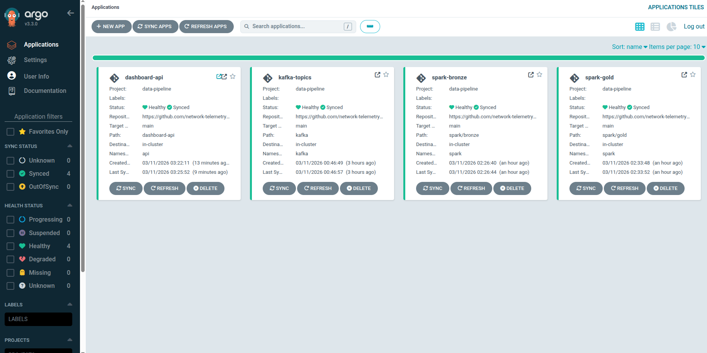

# data-pipeline

Kubernetes manifests and application code for the network telemetry data pipeline. Deployed via ArgoCD (GitOps).

## Architecture

```
Router devices
      │
      ▼
Kafka (router.metrics.raw)
      │
      ▼
Spark Bronze Job  ──►  MinIO/S3 (Parquet, bronze/router_metrics)
                              │
                              ▼
                    Spark Gold Job  ──►  PostgreSQL (gold_fleet_hourly, gold_device_hourly)
                                               │
                                               ▼
                                      FastAPI + Dashboard (ccmllab.mooo.com)
```

## Repository Structure

```
data-pipeline/
├── argocd/                        # ArgoCD Application CRs
│   ├── kafka-topics-app.yaml
│   ├── spark-bronze-app.yaml
│   ├── spark-gold-app.yaml
│   └── dashboard-api-app.yaml
│
├── kafka/                         # Strimzi KafkaTopic CRs
│   └── router-metrics-raw-topic.yaml
│
├── spark/
│   ├── bronze/                    # Spark Structured Streaming: Kafka → S3 Parquet
│   │   ├── router-bronze-rbac.yaml
│   │   ├── router-bronze-configmap.yaml
│   │   └── router-bronze-sparkapplication.yaml
│   └── gold/                      # Spark Batch: S3 Parquet → PostgreSQL
│       ├── gold-postgres-rbac.yaml
│       ├── gold-postgres-configmap.yaml
│       └── gold-postgres-sparkapplication.yaml
│
├── postgres/                      # PostgreSQL deployment and schema
│   ├── 00-namespace.yaml
│   ├── 01-postgres.yaml
│   ├── 02-init-sql-configmap.yaml
│   └── 03-init-db-job.yaml
│
└── dashboard-api/                 # FastAPI + dashboard manifests
    ├── namespace.yaml
    ├── secret.yaml
    ├── deployment.yaml
    ├── service.yaml
    └── ingress.yaml
```

## ArgoCD Apps

| App | Path | Namespace |
|---|---|---|
| `kafka-topics` | `kafka/` | `kafka` |
| `spark-bronze` | `spark/bronze/` | `spark` |
| `spark-gold` | `spark/gold/` | `spark` |
| `dashboard-api` | `dashboard-api/` | `api` |



Apply ArgoCD apps manually once (or via infra repo):

```bash
kubectl apply -f argocd/
```

## Dashboard API

The API serves aggregated telemetry from PostgreSQL. Endpoints:

| Endpoint | Description |
|---|---|
| `GET /api/fleet/hourly` | Hourly fleet-wide trends (default 7 days) |
| `GET /api/devices/top` | Top N devices by metric (`cpu_p95`, `mem_p95`, `packet_loss_p95`, `bgp_down_events`) |
| `GET /api/devices/{device_id}/hourly` | Per-device hourly timeseries |

Live at `https://ccmllab.mooo.com/api/...`

## Local Development

Port-forward the API and open `dashboard.html` in a browser:

```bash
kubectl -n api port-forward svc/telemetry-api 8080:80
# set const API = 'http://localhost:8080' in dashboard.html
```

## Data Flow

1. **Bronze** — Spark Structured Streaming reads `router.metrics.raw` from Kafka every micro-batch and writes Parquet to MinIO, partitioned by `dt/hour`.
2. **Gold** — Spark batch job reads bronze Parquet every 60 seconds and upserts hourly aggregates (avg, p95, counts) into PostgreSQL.
3. **API** — FastAPI queries PostgreSQL and serves JSON to the dashboard.

## Dependencies

- Strimzi Kafka operator (managed in infra repo)
- Spark operator (managed in infra repo)
- MinIO (`net-tel-minio.primary-object-store.svc.cluster.local`)
- cert-manager + Let's Encrypt (managed in infra repo)
- Sealed Secrets controller (managed in infra repo)
